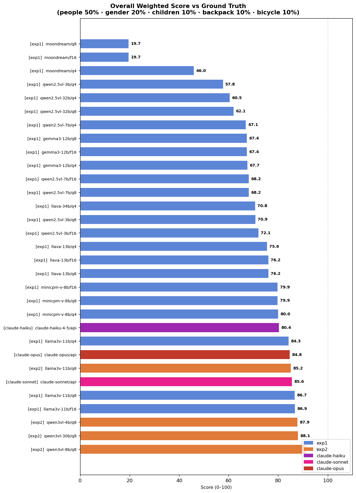
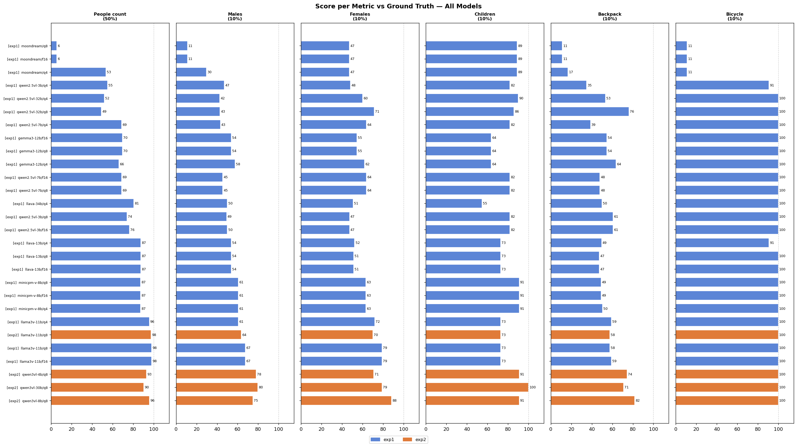

# vision-llm-benchmark

Automated benchmark that runs vision LLMs on a fixed image set, detecting people (gender/age), backpacks, and bicycles. Tests local models via [Ollama](https://ollama.com) and cloud models via the [Anthropic API](https://docs.anthropic.com/). Results are scored against manual ground truth and saved per-run with CSV tables and comparison plots.

---

## Results

### Overall weighted accuracy score

People count contributes 50% of the score. Gender, children, backpack, and bicycle each contribute 10%.



### Score breakdown by metric



---

## Hardware

| Component | Spec |
|---|---|
| GPU 0 | NVIDIA RTX 3090 — 24 GB VRAM |
| GPU 1 | NVIDIA RTX 3060 — 12 GB VRAM |
| Total VRAM | 36 GB pooled |
| CPU | Intel i7-7740X @ 4.30 GHz |
| RAM | 64 GB |
| OS | Linux (Ubuntu) |
| Driver | 570.211.01 |

The RTX 3090 is capped at **250W** by default (down from 350W) since LLM inference is memory-bandwidth bound. Override with `--gpu-power`.

---

## Experiments

### Experiment 1 — Broad model survey (`analyze_images_exp1.py`)

Wide comparison across 6 model families tested at q4, q8, and fp16 quantizations.

| Family | Sizes | q4 | q8 | fp16 | Notes |
|---|---|---|---|---|---|
| `qwen2.5vl` | 3B, 7B, 32B | ✓ | ✓ | ✓ (3B/7B) | Qwen2.5 Vision-Language |
| `llava` | 13B, 34B | ✓ | ✓ | ✓ (13B) | LLaVA v1.6 Vicuna base |
| `gemma3` | 12B | ✓ | ✓ | ✓ | Google Gemma 3 multimodal |
| `llama3.2-vision` | 11B | ✓ | ✓ | ✓ | Meta LLaMA 3.2 Vision |
| `minicpm-v` | 8B | ✓ | ✓ | ✓ | MiniCPM-V 2.6 |
| `moondream` | 1.8B | ✓ | ✓ | ✓ | Ultra-fast reference |

### Experiment 2 — Focused benchmark (`analyze_images.py`)

Focused on the most promising models at q8 only. Includes a warm-up step so model load time is excluded from benchmark timings.

| Family | Size | q8 | Notes |
|---|---|---|---|
| `llama3.2-vision` | 11B | ✓ | Meta LLaMA 3.2 Vision |
| `qwen3-vl` | 4B | ✓ | Qwen3 Vision-Language (bf16) |
| `qwen3-vl` | 8B | ✓ | Qwen3 Vision-Language (bf16) |
| `qwen3-vl` | 30B-A3B MoE | ✓ | 30B total / ~3B active; split across both GPUs |

### Cloud models (`run_claude.py`)

| Model | Avg time/img | Overall score |
|---|---|---|
| claude-sonnet-4-6 | 15.1s | 85.6 |
| claude-opus-4-6 | 4.2s | 84.8 |
| claude-haiku-4-5 | 1.8s | 80.4 |

---

## What It Detects

| Field | Type | Description |
|---|---|---|
| `total_people` | integer | Total visible persons including partial views |
| `males` | integer | Adults identified as male |
| `females` | integer | Adults identified as female |
| `children` | integer | Persons appearing under ~16 years old |
| `people_with_backpack` | integer | Persons with a clearly visible backpack |
| `bicycle_present` | boolean | Any bicycle visible (including parked) |
| `elapsed_sec` | float | Inference time for that image (excludes load time) |

---

## Scoring

Predictions are compared to `ground_truth.csv` (manual labels for all images):

| Metric | Weight | Method |
|---|---|---|
| People count | 50% | `max(0, 1 - \|pred-truth\| / truth)` |
| Males | 10% | same closeness score |
| Females | 10% | same closeness score |
| Children | 10% | same closeness score |
| Backpack count | 10% | same closeness score |
| Bicycle present | 10% | exact boolean match |

---

## Project Structure

```
vision-llm-benchmark/
├── analyze_images.py           # Experiment 2 — local models (current)
├── analyze_images_exp1.py      # Experiment 1 — broad local survey
├── run_claude.py               # Cloud benchmark via Anthropic API
├── score_models.py             # Score all runs vs ground truth + plots
├── ground_truth.csv            # Manual labels for all test images
├── scores_summary.csv          # Per-model weighted scores
├── scores_overall.png          # Bar chart: overall score all models
├── scores_by_metric.png        # Bar charts: score per metric all models
├── images/                     # Input images (JPG/PNG) — not committed
├── models/ollama/              # Model weights — not committed
└── runs/
    ├── 2026-03-31_10-52-52/    # Experiment 1 results
    ├── 2026-03-31_14-46-36/    # Experiment 2 results
    ├── claude_haiku/
    ├── claude_sonnet/
    └── claude_opus/
```

---

## Usage

```bash
# Local benchmark — Experiment 2 (recommended)
python3 analyze_images.py

# Local benchmark — Experiment 1 (broad survey)
python3 analyze_images_exp1.py

# Cloud benchmark (requires ANTHROPIC_API_KEY)
export ANTHROPIC_API_KEY=sk-ant-...
python3 run_claude.py --model haiku    # claude-haiku-4-5
python3 run_claude.py --model sonnet   # claude-sonnet-4-6
python3 run_claude.py --model opus     # claude-opus-4-6

# Score all runs and regenerate plots
python3 score_models.py

# Custom GPU power limits (watts, GPU 0 then GPU 1)
python3 analyze_images.py --gpu-power 280 170
python3 analyze_images.py --no-power-limit
```

### Requirements

```bash
pip install requests pandas matplotlib pillow anthropic
```

Ollama is started automatically if not already running. Models are pulled on first use.

---

## Planned: Ground Truth Expansion

- Precision/recall curves per model across quantization levels
- Speed vs accuracy scatter plot
- More images for statistical significance
